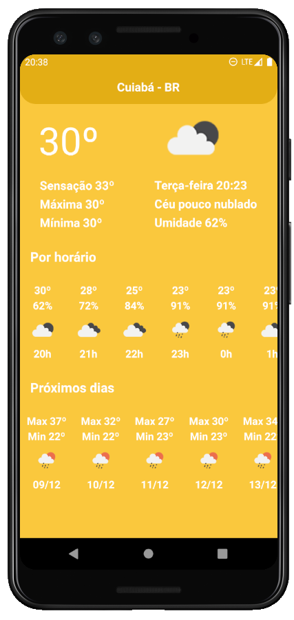

## Projeto iWeather

 

## :rocket: Tecnologias

Esse projeto foi desenvolvido com as seguintes tecnologias:

- [React Native](https://facebook.github.io/react-native/)
- [Styled Components](https://styled-components.com/)
- [Axios](https://github.com/axios/axios/)
- [React-Native Get Location](https://github.com/douglasjunior/react-native-get-location/)
- [API da OpenWeathe](https://openweathermap.org/api/)

## 💻 Projeto

Utilitario para visualizar o clima atual da sua região.

  

